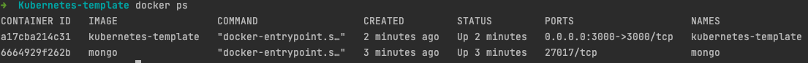

# Kubernetes Template

In this repository you will find a base project for notes taking which uses Node.js, Express, Pug and MongoDB.
We will be using Kubernetes to deploy the base project as Docker containers.

This guide will assume that you have kubectl, docker and minikube installed, if not, please follow:
[Docker installation](https://docs.docker.com/get-docker/)
[Kubectl installation](https://kubernetes.io/docs/tasks/tools/install-kubectl-macos/)
[Minikube installation](https://minikube.sigs.k8s.io/docs/start/)

## Containerising the app

Containerising your app can help you run processes without installing any dependency on your local machine because the 
container will have everything needed. This process in a container is isolated from everything else so when it runs, 
the process isn't aware of the host machine.

We have created a `Dockerfile` to define what goes in the container
```
FROM node:18.0-slim         # Version of node found in https://hub.docker.com/_/node/
COPY . .                    # Copy files to the container
RUN npm install             
CMD [ "node", "index.js" ]  # Commands that will run when the container is executed
```

Run the `docker build -t kubernetes-template .` to build the container image.
Note: `-t` is to define the tag of the container and `.` is the location of the Dockerfile in our application.

This image is an archive with all the files in a container. You can see the images with `docker images` command.

##  Connecting containers

Our application kubernetes-template uses MongoDB database locally. But we can use the MongoDB 
[mongo](https://hub.docker.com/_/mongo?tab=description) Docker image, and it can be run with `docker run mongo`.
Connect the containers that allowing communication between them by setting the same Docker network.

Create a network by running
```
$ docker network create kubernetes-template-network
```

After creating the network, we can run the kubernetes container together with mongo with
```
$ docker run --name=mongo --rm --network=kubernetes-template-network mongo
```

Now that mongo is running, we can start up our application container on another terminal with
```
$ docker run --name=kubernetes-template --rm --network=kubernetes-template-network -p 3000:3000 -e MONGO_URL=mongodb://mongo:27017/dev kubernetes-template
```



Note:
You can stop and remove the containers as 
```
$ docker stop mongo kubernetes-template
$ docker rm mongo kubernetes-template
```

## Upload image to DockerHub

Create a [Docker Id](https://login.docker.com/u/login/identifier?state=hKFo2SBuOEpkVFl1OFhVZzI5a3g0U2NfQldsOExRQVNWOHotbaFur3VuaXZlcnNhbC1sb2dpbqN0aWTZIC1vZ2d2UUxxUUxDZFd2NHZFUkRFV0Q3Yno5R21nRVR0o2NpZNkgbHZlOUdHbDhKdFNVcm5lUTFFVnVDMGxiakhkaTluYjk)
if you don't already have one, the Docker Id will be the DockerHub username

To login into Docker run:
```
$ docker login
```

Now we can upload our image with the following command:
```
$ docker tag kubernetes-template <username>/kubernetes-template:1.0.0
```
Note:
Images uploaded to DockerHub must have the following format: `username/image:tag`

Now the image for the application will be available on DockerHub at https://hub.docker.com/repository/docker/{username}/{image}
and we can pull the image and run it directly from DockerHub as
```
$ docker run --name=mongo --rm --network=kubernetes-template-network mongo
$ docker run --name=kubernetes-template --rm --network=kubernetes-template-network -p 3000:3000 -e MONGO_URL=mongodb://mongo:27017/dev <username>/kubernetes-template:1.0.0
```

## Define a Deployment
Before continuing this guide, it is advised to read [Kubernetes guide](https://morsoft.akurey.com/web#id=480&action=1380&model=knowsystem.article&view_type=form&cids=1&menu_id=922)
in Odoo.

Now that we have the containers available, we can define our Deployment, this will be set inside the kubernetes folder where
all our Kubernetes resources will be.

We define the deployment yaml as:

```yaml
apiVersion: apps/v1
kind: Deployment
metadata:
  name: kubernetes-template
spec:
  replicas: 1
  selector:
    matchLabels:
      app: kubernetes-template
  template:
    metadata:
      labels:
        app: kubernetes-template
    spec:
      containers:
        - name: app
          image: <username>/kubernetes-template # Uploaded from DockerHub
          ports:
            - containerPort: 3000
          env:
            - name: MONGO_URL
              value: mongodb://mongo:27017/dev
          imagePullPolicy: Always
```

This Deployment yaml defines how to run the application but we need to expose it with a Service, making Pods accessible
to other Pods or users outside the cluster.

```yaml
apiVersion: v1
kind: Service
metadata:
  name: kubernetes-template
spec:
  selector:
    app: kubernetes-template
  ports:
    - port: 80
      targetPort: 3000
  type: LoadBalancer
```

With that, we now exposed the Pods to be accessible from outside the cluster.

### Define Deployment for the database

We need to define a persistent volume for Mongo, so we can define this by using `PersistentVolumeClaim`.
We do this by defining the following yaml:

```yaml
apiVersion: v1
kind: PersistentVolumeClaim
metadata:
  name: mongo-persisting-volume
spec:
  accessModes:
    - ReadWriteOnce
  resources:
    requests:
      storage: 256Mi
```

Besides the `PersistentVolumeClaim`, we need to define the Service and the Deployment:

```yaml
# service yaml
apiVersion: v1
kind: Service
metadata:
  name: mongo
spec:
  selector:
    app: mongo
  ports:
    - port: 27017
      targetPort: 27017
```
Note: 
Since it doesn't have a `type` it defaults to `ClusterIp`. 
`ClusterIP` makes the Pod accessible from within the cluster but not from outside since only our application needs to have
access to the db Pod.

```yaml
# deployment yaml
---
apiVersion: apps/v1
kind: Deployment
metadata:
  name: mongo
spec:
  selector:
    matchLabels:
      app: mongo
  template:
    metadata:
      labels:
        app: mongo
    spec:
      containers:
        - name: mongo
          image: mongo:6.0.2-focal
          ports:
            - containerPort: 27017
          volumeMounts:
            - name: storage
              mountPath: /data/db # Where MongoDB will save its data
      volumes:
        - name: storage
          persistentVolumeClaim:
            claimName: mongo-persisting-volume
```

## Deploying the application

Make sure that minikube is started with `minikube start` or check it with `minikube status`.
Submit the resources definitions to Kubernetes (resources inside the kubernetes folder) with:
```
$ kubectl apply -f kubernetes
```

This will submit all yaml files inside the kubernetes directory to Kubernetes, and Kubernetes will create the Pods.
We can check the pods with: 
```
$ kubectl get pods --watch
```

We can access our application through kubernetes-template Service defined in the yaml with:
```
$ minikube service kubernetes-template url
```
This will return a URL which we can open it.

To remove the cluster, run:
```
$ kubectl delete -f kubernetes
```
This will delete all resources created with `kubectl apply`.

## Making our application Stateless

Making our application stateless will allow us to kill an instanced or duplicate it without any data loss.
It will also allow us to have an application that can be scalable. Remove the clusters:
```
$ kubectl delete -f kubernetes
```

We are going to use MinIO which is an open source object storage that can be installed in the infrastructure.
In order to use MinIO we need three additional variables:
```yaml
# kubernetes-template.yaml Deployment section
...
- name: MINIO_ACCESS_KEY
  value: mykey
- name: MINIO_SECRET_KEY
  value: mysecret
- name: MINIO_HOST
  value: minio
...
```

But we need to create a component in Kubernetes for MinIO, same as Mongo, we are going to define the PersistentVolumeClaim,
Deployment and Service
```yaml
# PersistentVolumeClaim yaml 
apiVersion: v1
kind: PersistentVolumeClaim
metadata:
  name: minio-persisting-volume
spec:
  accessModes:
    - ReadWriteOnce
  resources:
    requests:
      storage: 256Mi
```

```yaml
# Service yaml
apiVersion: v1
kind: Service
metadata:
  name: minio
spec:
  selector:
    app: minio
  ports:
    - port: 9000
      targetPort: 9000
```

```yaml
# Deployment yaml
apiVersion: apps/v1
kind: Deployment
metadata:
  name: minio
spec:
  strategy:
    type: Recreate
  selector:
    matchLabels:
      app: minio
  template:
    metadata:
      labels:
        app: minio
    spec:
      containers:
        - name: minio
          image: minio/minio:RELEASE.2022-10-29T06-21-33Z
          args:
            - server
            - /storage
          env:
            - name: MINIO_ACCESS_KEY
              value: mykey
            - name: MINIO_SECRET_KEY
              value: mysecret
          ports:
            - containerPort: 9000
          volumeMounts:
            - name: storage
              mountPath: /storage
      volumes:
        - name: storage
          persistentVolumeClaim:
            claimName: minio-persisting-volume
```

Now if we run 
```
$ kubectl apply -f kubernetes
```

We can get again the URL with:
```
$ minikube service kubernetes-template --url
```

We can scale the app with
```
$ kubectl scale --replicas=10 deployment/kubernetes-template
```

And there should be 9 additional Pods
```
$ kubectl get pods -l app=kubernetes-template --watch
```

This way, we now have a persistent volume and if one Pod is deleted or fails, another Pod can still access data from
the storage.

Note:
Remember to delete the app and stop minikube with:
```
$ kubectl delete -f kubernetes
$ minikube stop
```